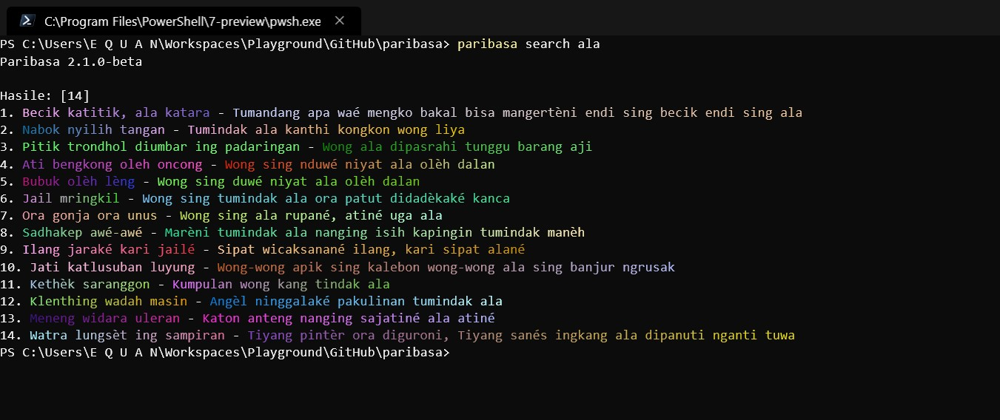

# Paribasa

> This readme is written in javanese language, for english please read in [README_EN](README_EN.md). 
> Thanks

Aplikasi iki di gawe mbantu ngilingake paribasa jawa seng jumlae wuakeh.


## Carane

Install aplikasi Paribasa iki disek nang komputermu (dianggep sakdurunge ndek komputermu kudu wes terinstall Node.js versi 4 menduwur)

```
# npm install -g @junwatu/paribasa

```
terus supoyo salah siji paribasa iso metu ndek tampilan terminal misale lek awakmu nggawe OS Linux,

```
$ paribasa
"Wéruh ing grubyug, ora wéruh ing rémbug" - Melu-melu tumindak nanging ora ngérti kang dikarepaké

``` 

Nggawe alat iki awakmu yo iso nggoleki paribasa tekok kata, contone



## Pustaka
Lek awakmu developer, aplikasi iki iso digawe pisan ndek aplikasimu istilahe **di import**

```
var paribasa = require('paribasa')
// random output
console.log(paribasa.get())
```

Luwih jelase deloken nang berkas [API](API.md) tapi jek bahasa inggris. 

Suwun

## License 

MIT License
