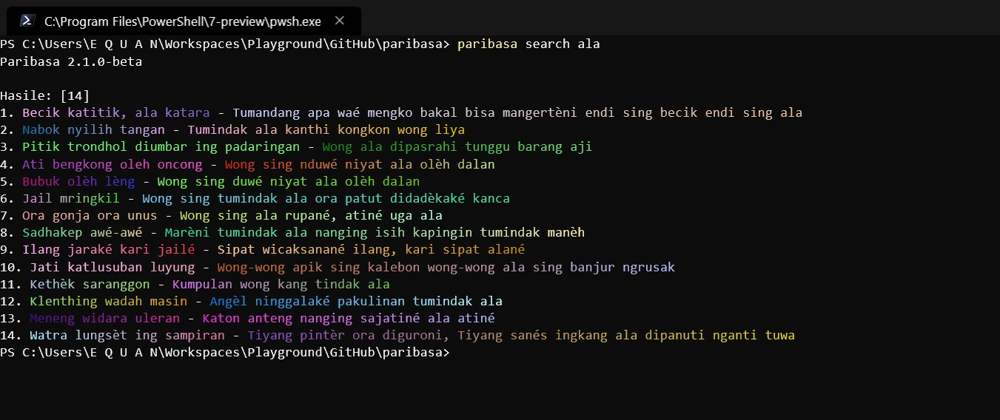

# Paribasa

Paribasa is, you can call it as Javanese quotes. This module can be use as CLI or import the library to your application.

## Installation

```
$ npm install -g @junwatu/paribasa
```

## CLI

Randomize Paribasa

```
$ paribasa
"Wéruh ing grubyug, ora wéruh ing rémbug" - Melu-melu tumindak nanging ora ngérti kang dikarepaké

```

Search Paribasa based on word



or you can see API documentation on [API.md](API.md)

## Paribasa API v3.0.0

```
import * as paribasa from 'paribasa'
// random output
console.log(paribasa.getRandomQuote())
// query
console.log(paribasa.searchQuote('ala'))

```

---

## License 

MIT License
